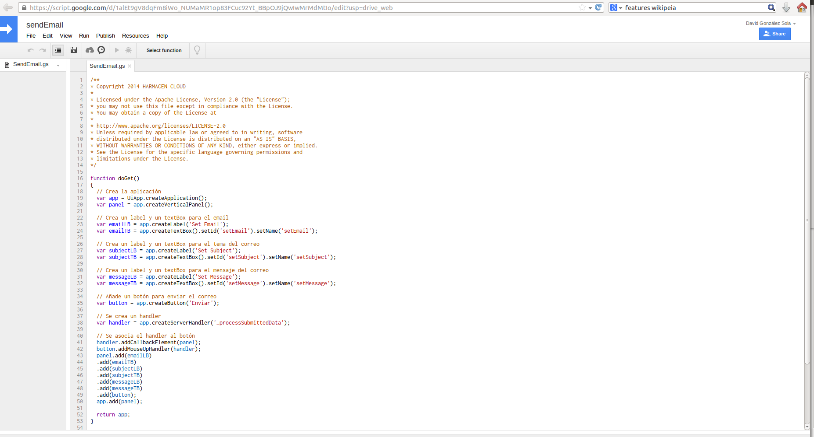
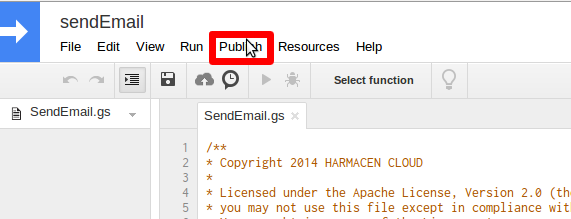
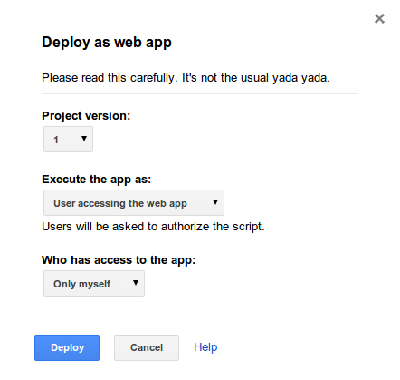
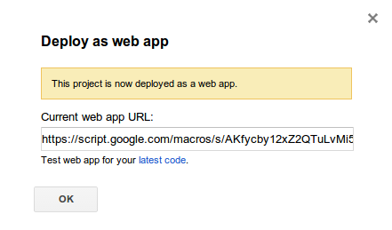
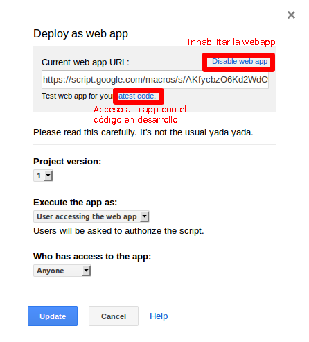

# Tutorial sobre el despliegue en GAS

En este tutorial se va a explicar de manera sencilla y mediante imágenes como desplegar un script de *Google App Script* (GAS) como una aplicación web.

## Scripts de GAS

Los scripts de *GAS* están escritos en *javascript*. Estos scripts están formados por una serie de funciones desarrolladas por el programador.

Una de las funciones a implementar es la función *doGet*. Esta función es la primera que se ejecuta una vez se accede a la URL donde el script esté desplegado. Esta función permite un parámetro de entrada que contiene toda la información que se pase a través de la URL.

## Despliegue

El despliegue de los scripts de *GAS* se hace de manera transparente al usuario a través de la propia interfaz de edición de los scripts.

### Pasos para el despliegue

Como se ha dicho anteriormente, el despliegue se lleva a cabo a través de la interfaz. A continuación se van a resumir los pasos para llevar a cabo este despliegue:

1. En la barra superior de edición, abrir el menú desplegable *Publish* y seleccionar la opción *Publish as web app...*, esto abrirá una pequeña ventana.

2. La primera vez que se vaya a desplegar una *web app* aparecerá una ventana la mostrada a continuación. En esta ventana podemos seleccionar la versión actual del proyecto, quién se encargará de ejecutar la aplicación y finalmente la opción más importante, quién tendrá acceso a la *web app*. Esta última opción permite tres valores distintos:
    * Only myself: solo tú tendrás acceso a la webapp, útil si es una versión en desarrollo.
    * Anyone: cualquier tipo de usuario con una cuenta.
    * Anyone, even anonymous: cualquier tipo de usuario incluso sin estar registrado.
Una vez se selecciona la configuración deseada, se pulsa sobre el botón *deploy* para desplegar el proyecto.

3. Al desplegar el proyecto aparecerá una ventana con la URL donde se encuentra desplegada la *web app*.

4. Si ya se ha desplegado alguna vez el proyecto, cuando se pulse sobre la opción *Publish* - *Publish as web app...* la ventana será algo diferente al caso anterior. Esta vez, en la parte superior aparece la URL donde se encuentra desplegado actualmente el proyecto, además permite inhabilitar la *web app*. Finalmente, para probar la aplicación con los últimos cambios realizados sin tener que desplegarla, esta ventana te da acceso a la aplicación desplegada con el código actual en desarrollo, una opción vital para el desarrollo y testeo de la aplicación.

## Ejemplo de despliegue

En la siguiente URL puede acceder a una aplicación ya desplegada que permite enviar un email.

[Webapp para enviar un correo](https://script.google.com/macros/s/AKfycbzO6Kd2WdC9FCB2d_-IlTFpA-jqbYmM99uiNED3LdeFoAnvyKDg/exec)
